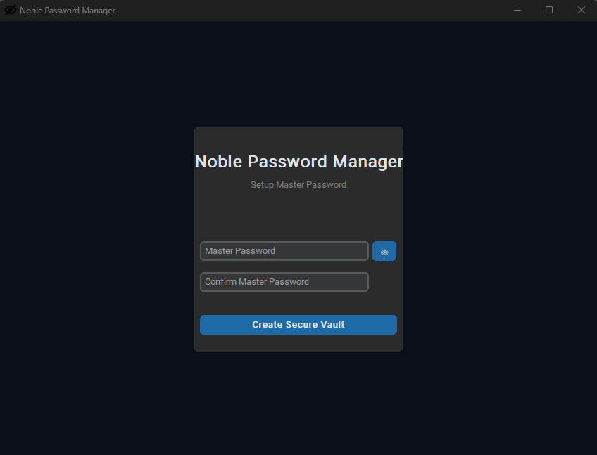
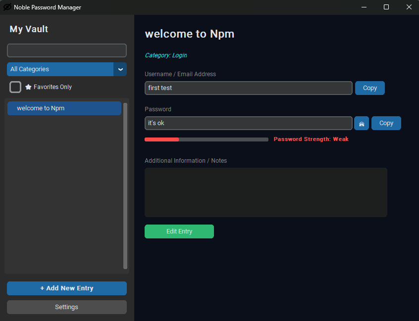

<p align="center">
  
</p>

<h1 align="center">Noble Password Manager</h1>

<p align="center">
  A local Windows password manager designed to store and manage credentials
  in an encrypted vault on the user's computer.
</p>

<p align="center">
  <strong>Version 0.0.4 Beta</strong>
</p>

<p align="center">
  <a href="../../releases/latest">Download</a>
  &nbsp;•&nbsp;
  <a href="#features">Features</a>
  &nbsp;•&nbsp;
  <a href="#security">Security</a>
  &nbsp;•&nbsp;
  <a href="../../issues">Issues</a>
</p>

---

## 📢 About

**Noble Password Manager (NPM)** is a local Windows password manager focused on storing credential data in an encrypted vault on the user's computer.

The project is **closed-source**. This public repository contains project documentation, release information, and downloadable binaries. The application source code is maintained separately.

> **Status:** Beta — `v0.0.4`

---

## 🔓 Download

### Noble Password Manager v0.0.4 Beta

Download the latest official release from GitHub:

**[Download the latest release](../../releases/latest)**

Available packages:

- **Setup** — Recommended for normal installation.
- **Portable** — Run the application without a traditional installation.

> **Beta software:** This release is intended for testing and feedback.

---

## 🖼️ Screenshots

<p align="center">
  
  
</p>

---

## ✨ Features

- Local encrypted password vault
- Master-password protection
- Password generator
- Password-strength indicator
- Categories and favorites
- Search
- Password visibility controls
- Encrypted vault backup and export
- Encrypted vault import and restore
- Master-password change
- Automatic inactivity lock
- English and Farsi interface
- Multiple appearance themes

---

## 🛡️ Security

Noble Password Manager currently uses the following cryptographic design:

| Component | Implementation |
|---|---|
| Authenticated encryption | **Fernet** |
| Key derivation | **PBKDF2-HMAC-SHA256** |
| PBKDF2 iterations | **600,000** |
| Derived key length | **32 bytes** |
| Vault salt | **16-byte random salt** |

The master password is used to derive the encryption key for the vault. A random salt is stored alongside the encrypted vault data; the salt itself is not secret.

For more information, see the [Security Model](docs/SECURITY_MODEL.md).

> **Security notice:** Noble Password Manager v0.0.4 Beta has not undergone an independent professional security audit. The application should therefore be treated as security-sensitive beta software.

Users should maintain independent backups of important encrypted vaults.

---

## 💽 Storage

On Windows, Noble Password Manager stores its application data under:

```text
%APPDATA%\NoblePasswordManager\

```

## 🚀 Installation & Requirements

For a detailed breakdown of dependencies, versions, and package details, please check [requirements.md](requirements.md).

### Prerequisites
* Python 3.9 or higher

### 1. Clone the Repository
Open your Command Prompt (`cmd`) or Terminal and run:
```cmd
git clone [https://github.com/shattered-Devil/Noble-Password-Manager.git](https://github.com/shattered-Devil/Noble-Password-Manager.git)
cd Noble-Password-Manager
